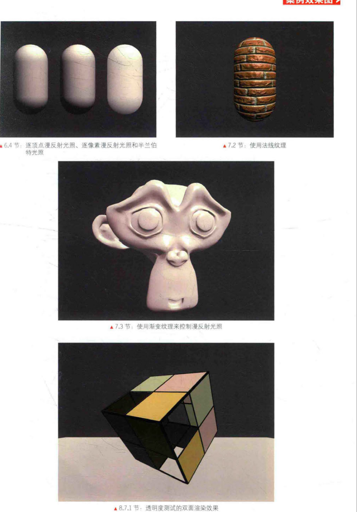
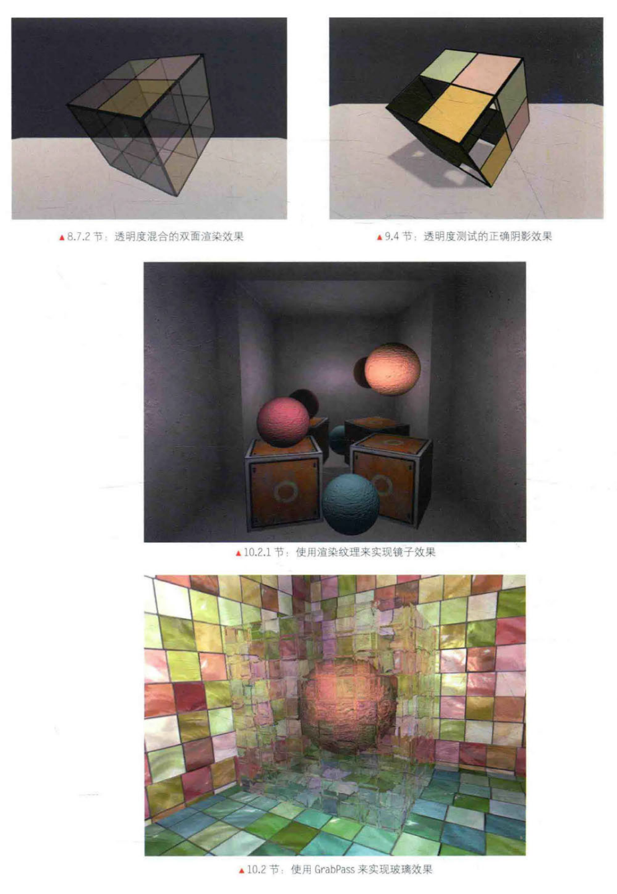
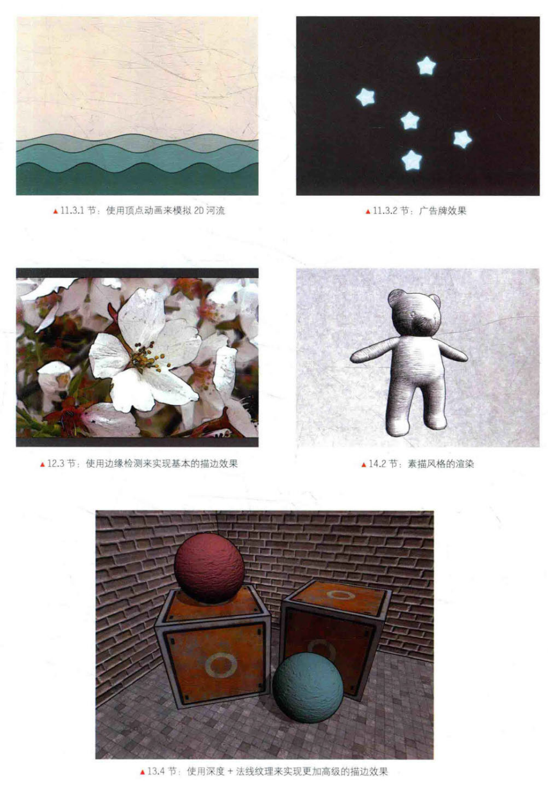
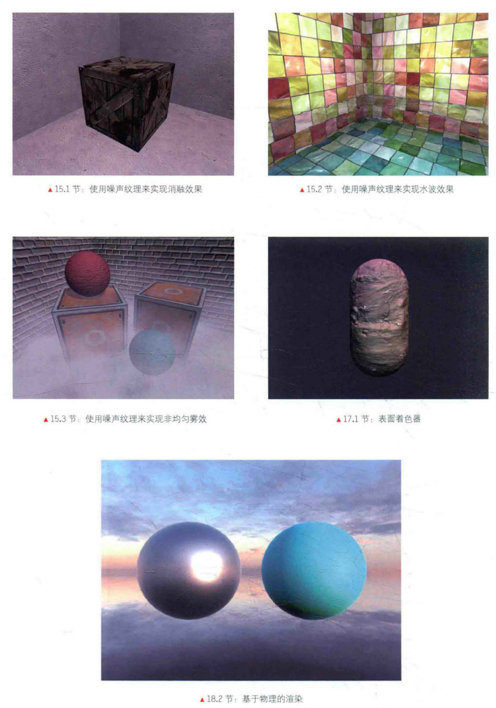
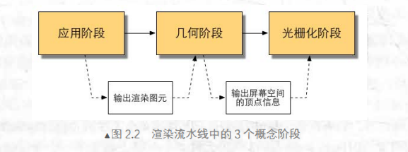
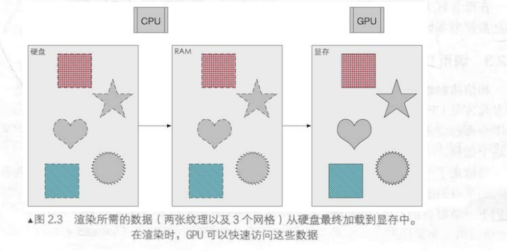
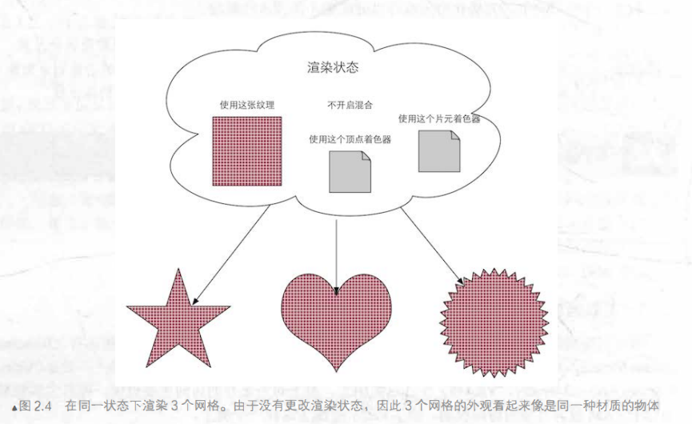
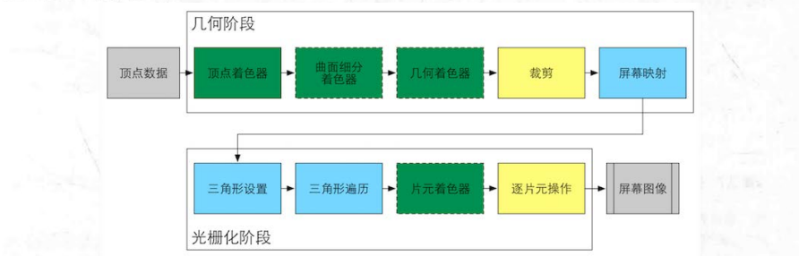

# Shder入门精要

## 引言









==实在是美丽得很啊，希望这次能坚持把Shader入门，上面的图片也争取复现出来==

## 第一篇 基础篇(主要是数学基础)

### 第1章 欢迎来到Shader的世界

#### 程序员的三大浪漫

- 编译原理
- 操作系统
- 图形学

#### 本书结构

此文档的大纲就代表着本书结构，这本书一眼就吸引了我，画面足够精美(学Shader不精美怎么学得进去呢)，内容循序渐进

### 第2章 渲染流水线

#### 综述

##### 什么是流水线

> 例子：老王有 个生产洋娃娃的工厂， 一个洋娃娃的生产流程可以分为4
> 个步骤 。1、制作洋娃娃的躯干；2、缝上眼睛和嘴巴 3、添加头发 4、
> 给洋娃娃进行尿后的产品包装(除了步骤2都是一小时)

如果一个人做完四个步骤，需要5个小时

==引入流水线，提高单位时间产量，平均2个小时完成一个(起决定因素的就是最慢的部分)==

**理想状态：把一个系统分为n份等时流水线，速度会提升n倍**

##### 什么是渲染流水线

渲染流水线的工作在于三维场景渲染一张二维图像(CPU和GPU共同完成)

渲染流程三阶段：

1. 应用阶段
2. 几何阶段
3. 光栅化阶段



- **应用阶段**

  CPU负责实现，开发者有绝对控制权

  三个任务：**准备场景数据**， **粗粒度剔除(culling，不可见物品移除)**，**设置渲染状态(材质、纹理、Shader等)**

  输出：渲染所需要的几何信息(**渲染图元(rendering primitives)**)

  *由于是开发者主导，不在这本书的范围内*


- **几何阶段**

  通常在GPU进行

  任务：**顶点坐标变换到屏幕空间中**

  输出：屏幕空间的二维顶点坐标(顶点对应的深度值、着色等)


- **光栅化阶段**

  GPU实现

  主要任务：**决定每一个图元中哪些像素应该被绘制在屏幕上**，逐顶点数据插值，再逐像素处理

#### CPU和GPU之间的通信

应用阶段的三个小阶段：

- 数据加载到显存中
- 设置渲染状态
- 调用Draw Call

##### 数据加载到显存



硬盘(HDD)——>内存(RAM)——>显存(VRAM)(显卡对其访问速度快，且大多显卡对内存没有访问权限)

==注意点：加到显存后，RAM的数据可以移除了，但对于一些数据(网格数据进行碰撞检测等)，我们可能就不希望这些数据被移除==

##### 设置渲染状态



渲染状态：==顶点着色器/片元着色器、光源属性、材质==

##### 调用Draw Call

它是一个命令，CPU发起，GPU接收，仅仅会指向需要被渲染的图元列表，不包含任何材质信息，GPU会根据**渲染状态和输入的顶点数据**进行**计算**==这个计算，就是GPU流水线==

输出：显示的漂亮的像素

#### GPU流水线

##### 概述



绿色(**完全可编程控制的**)：==顶点着色器、曲面细分着色器、几何着色器、片元着色器==

黄色(**可以配置但不可编程**)：==裁剪、逐片元操作==

蓝色(**GPU固定了实现的**)：==屏幕映射、三角形设置、三角形遍历==

##### 顶点着色器

流水线第一个阶段
输入：CPU
调用：每个顶点调用一次，顶点着色器无法创建或销毁顶点
工作：
- 坐标变换
可以改变顶点位置，在**顶点动画**是很有用的。==把顶点坐标从模型空间转换到齐次裁剪空间是必须完成的==
```shader
o.pos = mul(UNITY_MVP, v.position);
```
![[picture/模型顶点变换到齐次裁剪坐标空间.png]]
- 逐顶点光照

##### 裁剪

不在摄像机范围的物体不需要被处理
![[picture/裁剪.png]]
上图中黄色的三角形需要裁剪，此时已知顶点在NCD(归一化设备坐标)下的坐标，裁剪还是很简单的

##### 屏幕映射

把每个图元的x和y坐标转化到**屏幕坐标系**，此时不会对z坐标做任何处理(屏幕坐标系和z构成一个坐标系叫**窗口坐标系**)
![[picture/屏幕映射.png]]
OpenGL和DirectX在这步有差异，前者左上角是最小值，后者左下角
>所以开发时如果图像倒转，很有可能是这个原因，要特别注意

##### 三角形设置

开始进入光栅化阶段
输入数据：屏幕坐标系位置、z、法线方向、视角方向
工作：计算三角网格表示数据(得到三角网格对像素的覆盖情况，*必须计算每条边的像素坐标*)，主要是为了给下一个阶段做准备

##### 三角形遍历(扫描变换)

工作：检测每个像素是否被一个三角网格覆盖，如果被覆盖，就会生成一个==片元(fragment)==
并且还会对整个覆盖区域进行插值
![[picture/三角形遍历.png]]
输出：片元序列(片元不是真正意义上的像素，而是包含很多状态的集合，屏幕坐标、深度信息、法线、纹理坐标等)

##### 片元着色器(DirectX中称像素着色器)

输入：上个阶段对顶点信息插值得到的结果
工作：最重要的就是可以进行纹理采样
*局限：仅可以影响单个片元，不可以将影响发给附近片元(有例外情况，自己了解)

##### 逐片元操作

**逐片元操作(Per-Fragment Operations)**：OpenGL中的说法
**输出合并阶段(Output-Merger)**：DirectX中的说法

主要任务：
- 决定每个片元的可见性(深度测试、模板测试等)
- 如果一个片元通过了所有测试，需要把这个片元的颜色值和已经存储在缓冲区中的颜色进行合并(混合)
![[picture/模板测试和深度测试流程图.png]]
上面是两个测试的流程图，需要注意的点是，不管片元有没有通过模板测试，我们都可以根据模板测试和下面的深度测试结果来修改模板缓冲区
模板测试通常用于**限制渲染区域**

